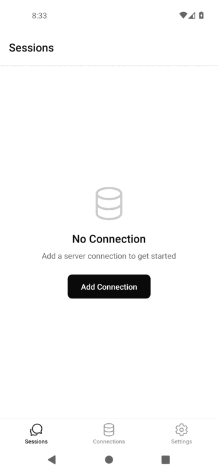

# OpenCode Mobile

**The open-source Android client for the [opencode](https://github.com/sst/opencode) AI coding agent.**
AI-assisted coding from your phone — Android, via Google Play, F-Droid, or a direct APK.

[](LICENSE)
[](https://dzianisv.github.io/opencode-mobile/fdroid/repo)
[](https://github.com/dzianisv/opencode-mobile/releases/latest)
[](https://play.google.com/store/apps/details?id=cc.agentlabs.opencode)

> **Not affiliated with opencode.** OpenCode Mobile is an independent, community-built client and is
> not made by, endorsed by, or affiliated with the opencode / Anomaly team. It talks to an opencode
> server you run yourself, using opencode's open HTTP API.

---

**New: tap "Try a Demo" in the app to see the agent fix a real bug — reasoning, a grep, a diff, a permission prompt — in about 30 seconds, no server needed.**

---

## Install (Android)

There are **three working ways** to install OpenCode Mobile today, all for Android:

1. **Google Play** — **https://play.google.com/store/apps/details?id=cc.agentlabs.opencode**

2. **F-Droid (self-hosted repo)** — add our self-hosted repo to any F-Droid client, then install/update from there:
   ```
   https://dzianisv.github.io/opencode-mobile/fdroid/repo
   ```
   In the F-Droid app: **Settings → Repositories → + (add)** and paste the URL above. Current version: **v0.4.7**.

3. **Direct signed APK** — download the latest release and install it manually:
   **https://github.com/dzianisv/opencode-mobile/releases/latest**

> iOS is not available (see [Roadmap](#roadmap)). IzzyOnDroid submission is pending.

---

OpenCode Mobile is a React Native / Expo app that brings the power of the [opencode](https://github.com/sst/opencode) AI coding agent to your phone. Connect to your own self-hosted opencode server over your local network, a Cloudflare Tunnel, ngrok, or Tailscale — and write, review, and ship code from anywhere. The mobile client is **free and open-source** under the MIT license. There is no feature gate, no telemetry you did not opt into, and no ad network.

---

<p align="center">
  
</p>

<sub>Real on-device capture: add a connection, browse sessions, and watch the agent stream a response. Verified end-to-end on an Android emulator against a live opencode server (build cc.agentlabs.opencode).</sub>

---

## Features

- **Offline demo mode** — tap "Try a Demo" to see a full bug-fix walkthrough (reasoning → grep → diff → permission prompt) with zero setup, right from the empty state
- **Multi-connection** — manage multiple opencode servers (local network, Cloudflare Tunnel, ngrok, or Tailscale)
- **Biometric unlock** — Face ID, Touch ID, or Android fingerprint protects the app and individual message sends
- **Streaming chat** — token-by-token streaming responses directly from your opencode server
- **Diff viewer** — inline side-by-side diffs of every file change the agent makes
- **Tool call approval** — review and approve (or reject) tool calls before the agent executes them
- **Secure credential storage** — server credentials stored in the Android Keystore via `expo-secure-store`
- **Session management** — browse, create, and resume coding sessions

---

## Get OpenCode Mobile

Package: `cc.agentlabs.opencode` · Android only · current version v0.4.7

| Channel | Status | How |
|---|---|---|
| **Google Play** | **Live** | [play.google.com/store/apps/details?id=cc.agentlabs.opencode](https://play.google.com/store/apps/details?id=cc.agentlabs.opencode) |
| **F-Droid (self-hosted repo)** | **Live** | Add [`https://dzianisv.github.io/opencode-mobile/fdroid/repo`](https://dzianisv.github.io/opencode-mobile/fdroid/repo) in your F-Droid client |
| **Direct APK** | **Live** | [github.com/dzianisv/opencode-mobile/releases/latest](https://github.com/dzianisv/opencode-mobile/releases/latest) |
| IzzyOnDroid | Submission pending | Not live yet |
| Apple App Store / iOS | Not available | See [Roadmap](#roadmap) |

> The three live, supported install channels are **Google Play**, the **F-Droid self-hosted repo**, and the **direct signed APK**, all Android. IzzyOnDroid is pending, and there is no iOS build.

---

## Quick Start

**Don't have a server yet?** Install the app and tap **Try a Demo** on the Sessions screen first — no setup required. It plays back a scripted bug-fix session through the app's real chat, diff, and permission-approval UI, offline, in about 30 seconds.

**Step 1 — Start opencode on your machine**

```bash
# Install opencode (if you haven't already)
npm install -g opencode-ai

# Run opencode in server mode
OPENCODE_SERVER_PASSWORD=yourpassword opencode serve --hostname 0.0.0.0 --port 4096
```

**Step 2 — Install OpenCode Mobile** via [Google Play, F-Droid, or a direct APK](#install-android) (or build from source — see [CONTRIBUTING.md](CONTRIBUTING.md)).

**Step 3 — Add a connection in the app**

Open the app, tap **Add Connection**, and choose your connection type:

- **Local network** — your machine's LAN IP, e.g. `http://192.168.1.100:4096`
- **Tunnel** — a Cloudflare Tunnel or ngrok URL, e.g. `https://my-opencode.trycloudflare.com`
- **Tailscale** — your machine's Tailscale IP, e.g. `http://100.x.x.x:4096`
- **opencode Cloud** *(planned — not yet shipped)* — one-tap managed hosting, no server to run

Enter the password you set in Step 1, tap **Connect**, and you're in.

---

## How It Works

OpenCode Mobile is a thin client. It speaks the opencode HTTP + SSE API: listing sessions, sending messages, streaming responses, and subscribing to file-change events. All AI model calls are handled by your opencode server — you bring your own API keys (OpenAI, Anthropic, etc.) and the app never touches them. The app never proxies your code or conversation through our servers.

```
┌─────────────────────────────────────┐
│         OpenCode Mobile             │
│  (React Native / Expo, this repo)   │
└──────────────┬──────────────────────┘
               │  HTTP + SSE
               │  (local network / tunnel)
               ▼
┌─────────────────────────────────────┐
│       opencode server               │
│  (github.com/sst/opencode, MIT)     │
│  Running on your laptop / VPS       │
└──────────────┬──────────────────────┘
               │  API calls
               ▼
┌─────────────────────────────────────┐
│   Your AI provider                  │
│  (OpenAI / Anthropic / Gemini / …)  │
│  Your keys, your bill               │
└─────────────────────────────────────┘
```

---

## Project Status

**Current version: v0.4.7**

| Feature | Status |
|---|---|
| Offline demo mode | Stable |
| First-run onboarding clarity | Stable |
| Multi-connection management | Stable |
| Session list + creation | Stable |
| Streaming chat | Stable |
| Diff viewer | Stable |
| Biometric unlock | Stable |
| Tool call approval UI | Stable |
| Sentry crash reporting (opt-in) | Stable |
| Cloudflare / ngrok tunnel wizard | Beta |
| opencode Cloud one-tap connect | Planned |
| iPad / tablet layout | Planned |
| Offline session history | Planned |

---

## Supporters and Sponsors

OpenCode Mobile is built and maintained by [VIBE TECHNOLOGIES, LLC](https://agentlabs.cc/opencode). GitHub Sponsors help cover Sentry, EAS Build, and CI costs (~$60/month). The opencode Cloud hosted backend (planned, $10/mo) is the long-term revenue model.

If OpenCode Mobile saves you time, consider sponsoring:

**[github.com/sponsors/VibeTechnologies](https://github.com/sponsors/VibeTechnologies)**

| Tier | Price | Perk |
|---|---|---|
| Supporter | $5/mo | Your name in `SUPPORTERS.md` |
| Backer | $15/mo | Name + early access to opencode Cloud beta |
| Business | $50/mo | Logo on [agentlabs.cc/opencode](https://agentlabs.cc/opencode) + quarterly support call |

Questions or private support: [support@agentlabs.cc](mailto:support@agentlabs.cc)

---

## Roadmap

Tracked on the [GitHub Projects board](https://github.com/dzianisv/opencode-mobile/projects) and in the [open milestones](https://github.com/dzianisv/opencode-mobile/milestones).

Near-term priorities:
- opencode Cloud one-tap connect + managed hosting
- F-Droid mainline acceptance (FCM audit + reproducible build verification)
- Tunnel setup wizard (Cloudflare / ngrok / Tailscale)
- iPad / tablet layout
- Offline session history cache

---

## Contributing

We welcome bug reports, feature requests, and pull requests. See [CONTRIBUTING.md](CONTRIBUTING.md) for how to set up a dev environment and the contribution process.

---

## Privacy

OpenCode Mobile does not collect personal data. Optional Sentry crash reporting (opt-in, off by default) sends anonymised crash traces to Sentry. No analytics SDKs are bundled. Credentials are stored exclusively on-device in the OS keystore.

Full privacy policy: [dzianisv.github.io/opencode-mobile/privacy](https://dzianisv.github.io/opencode-mobile/privacy/)

---

## License

MIT — see [LICENSE](LICENSE).

Copyright (c) 2026 VIBE TECHNOLOGIES, LLC

---

## Acknowledgments

- [sst/opencode](https://github.com/sst/opencode) — the AI coding agent this app connects to (MIT)
- [Expo](https://expo.dev) — the React Native toolchain powering the app
- Every contributor who filed a bug, opened a PR, or starred the repo
